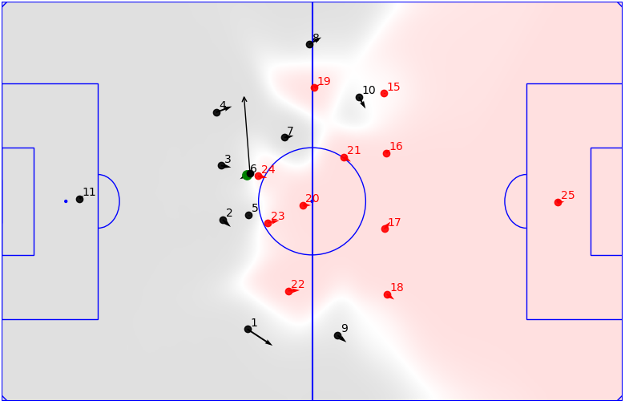

 # Soccer Data Analysis  :soccer:
 
Working with Metrica's tracking and event data for Soccer Analytics. Providing insightful pitch visualizations and clips from soccer matches.
Pitch Control to find controlled regions from teams is provided and EPV to calculate the probability that a possession leads to a goal.
Helpful for match analysis, player and team performance evaluation.
 
 

## About the data
- Two Sample Games in standar CSV format with synchronized Tracking and Event data (Metrica Sports).
- Details and proper documentation of the data can be found in the link below.
- Source: https://github.com/metrica-sports/sample-data

## General
- Default Pitch dimensions are **106 x 68 meters**.
- Home Team Players by default are colored **black** :black_circle: and Away Team Players are colored **red** :red_circle:.
- White Dot represents the ball.
- Arrows represent player velocities. Longer arrows indicate running faster.
- Numbers indicate players jerseys numbers.

  

## Potential Pitch Control Field - PPCF
- How Teams control regions,pass probability for an imaginary ball placed at every point on the pitch.
- Pitch Control at a Target Location is the probability that a team or a player will be able to control the ball if it were at that location.
- Gray regions are controlled by Home Team (black color :black_circle:)
- Red regions are controlled by Away Team (red color :red_circle:)
- Green Dot represents the ball.
- Player 6 passes at an area controlled by his teammate Player 4. That indicates higher success pass probability.

  

## Expected Possession Value - EPV
- EPV quantifies the value of possessing the ball at a given instance.
- It's the probability that the current possession will end in a goal given the current situation (ball & player position,match state etc.)
- Simplier approach: )
- Expected EPV at position pos: 
- Expected EPV added of a pass from pos1 to pos2: 
- Contour areas below represent high EPV added options. Player 19 passes the ball and 0.012 EPV is added

  

## Resources
For deep understanding of the formulas and the method used I suggest reading these amazing publications from William Spearman et al.:
- [Physics-Based Modeling of Pass Probabilities in Soccer](https://www.researchgate.net/publication/315166647_Physics-Based_Modeling_of_Pass_Probabilities_in_Soccer)
- [Beyond Expected Goals](https://www.researchgate.net/publication/327139841_Beyond_Expected_Goals)
- [EPV Calculation Approach](http://nessis.org/nessis11/rudd.pdf)

## Acknowledgments
- Thanks to "Friends of Tracking Data" for the useful content in soccer analytics.
- Thanks to Metrica Sports for the Data.
- EPV_grid.csv from HarvardSoccer.

